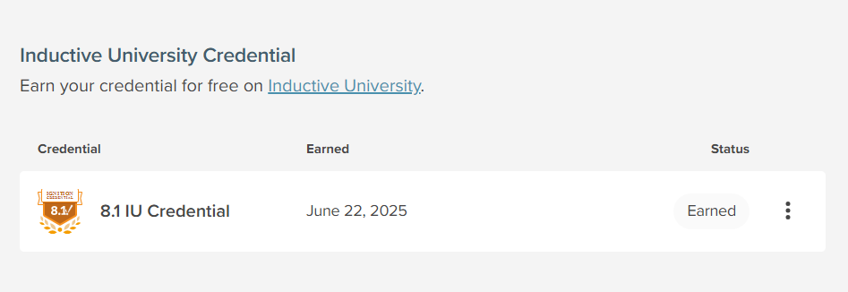

# 🛠️ Ignition 8.1 SCADA Credential – Training Summary

This repository documents my completion of the **Ignition 8.1 Credential** offered by Inductive University – a hands-on SCADA platform training by Inductive Automation.

---

## ✅ Credential Status

- **Status:** ✅ Earned  
- **Date:** June 22, 2025  
- **Platform:** [Inductive University](https://inductiveuniversity.com)

The training covered SCADA design and architecture using the **Ignition** platform — widely used in industrial automation, manufacturing, and infrastructure.

---

## 📚 Key Topics Covered

- Ignition Gateway setup and editions
- OPC-UA device connection and management
- Memory tags and Tag Historian
- Alarm creation, notification pipelines
- Vision and Perspective interface development
- SQL bindings and scripting logic
- Client deployment and user sessions

---
## 🧾 Credential Preview

> A snapshot of the earned credential:



📎 Viewable at: [Inductive University Profile](https://inductiveuniversity.com)

---
## 🖼️ Screenshots

> Located in the `/screenshots` folder:
- Gateway config
- Tag browser
- Alarm setup
- Vision UI layout

---

## 🧠 Notes

> Key takeaways from modules are included in `/notes/module-notes.md`

---

## 💬 Resume Line

```markdown
Ignition 8.1 Credential — Inductive University  
Completed training on SCADA fundamentals (tags, alarms, UI, OPC-UA) via Inductive Automation platform.
